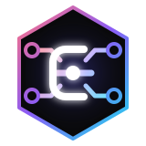

<p align="center">
  
</p>

<h1 align="center">Elysia MCP Adapter</h1>

<p align="center">
  Expose Elysia routes and MCP-native primitives through one secure Model Context Protocol endpoint.
</p>

<p align="center">
  <a href="https://www.npmjs.com/package/@mwillbanks/elysia-mcp-adapter"></a>
  <a href="./LICENSE"></a>
  <a href="https://mwillbanks.github.io/elysia-mcp-adapter/"></a>
</p>

`@mwillbanks/elysia-mcp-adapter` turns eligible Elysia HTTP routes into MCP tools while preserving the request lifecycle you already rely on: parsing, validation, hooks, guards, authentication, error handling, and response mapping. It also provides thin APIs for standalone tools, resources, resource templates, and prompts.

## Why this adapter?

- **Keep Elysia in charge.** Route-backed calls run through `app.handle(new Request(...))`; handlers are never invoked out of band.
- **Reuse schemas.** Existing TypeBox and route schemas are normalized to JSON Schema for MCP clients.
- **Secure by default.** Origin checks are enabled, model-controlled headers are denied, credential-bearing response headers are redacted, and binary responses are disabled.
- **Stay protocol-focused.** The package is ESM-only and does not introduce a second application framework or translate TypeBox to Zod.

## Install

```bash
bun add @mwillbanks/elysia-mcp-adapter elysia
```

Node.js `>=20.11`, Bun `>=1.1`, Elysia `>=1.4`, and TypeScript `>=5.8` are supported.

## Quick start

```ts
import { mcp } from '@mwillbanks/elysia-mcp-adapter'
import { Elysia, t } from 'elysia'

const app = new Elysia()
  .use(
    mcp({
      server: {
        name: 'users-api',
        version: '1.0.0'
      }
    })
  )
  .get(
    '/users/:id',
    ({ params }) => ({ id: params.id }),
    {
      params: t.Object({ id: t.String() }),
      detail: {
        operationId: 'users.get',
        summary: 'Get a user'
      }
    }
  )
  .listen(3000)
```

The adapter exposes `GET /users/:id` as the `users.get` MCP tool at `POST /mcp`. Tool calls are converted to internal HTTP requests and sent back through Elysia:

```json
{
  "jsonrpc": "2.0",
  "id": 1,
  "method": "tools/call",
  "params": {
    "name": "users.get",
    "arguments": {
      "params": { "id": "user_123" }
    }
  }
}
```

## Explicit MCP primitives

Install the plugin, then register MCP-only behavior alongside your HTTP routes:

```ts
const app = new Elysia()
  .use(mcp({ allowedRoutes: [] }))
  .mcpTool(
    'math.add',
    ({ a, b }: { a: number; b: number }) => ({ sum: a + b }),
    {
      inputSchema: {
        type: 'object',
        properties: {
          a: { type: 'number' },
          b: { type: 'number' }
        },
        required: ['a', 'b'],
        additionalProperties: false
      }
    }
  )
  .mcpResource('config://runtime', () => ({ environment: 'production' }))
  .mcpPrompt(
    'review-error',
    ({ message }: { message: string }) => `Review this error: ${message}`
  )
```

Routes become tools by default. Resources and prompts require explicit route metadata or the standalone methods above.

## MCP extensions

Tasks, OAuth resource-server enforcement, enterprise authorization profiles, and Apps are opt-in:

```ts
app.use(
  mcp({
    transport: {
      protocolVersions: ['2026-07-28', '2025-11-25']
    },
    extensions: {
      tasks: {
        version: 'current',
        provider
      },
      auth: {
        version: 'current',
        resource: 'https://api.example.com/mcp',
        authorizationServers: ['https://auth.example.com'],
        verifyAccessToken
      },
      apps: {
        version: 'current'
      }
    }
  })
)
```

Omitting an extension version selects `current`; `draft` and supported dated versions select immutable implementations recorded in the exported `MCP_EXTENSION_SUPPORT` manifest. Modern MCP `2026-07-28` uses per-request protocol metadata and `server/discover`, while legacy `2025-11-25` initialization remains supported. Tasks require modern MCP and a durable provider.

The repository includes tested, package-root examples for every extension:

- [Tasks](./examples/tasks/) uses SQLite subprocess workers and BullMQ with `ioredis-mock`.
- [Authorization](./examples/auth/) uses Better Auth, Bun SQLite, OAuth Provider, and SAML SSO.
- [Apps vanilla](./examples/apps-vanilla/) and [Apps React](./examples/apps-react/) build one self-contained HTML document with Bun and no Vite or runtime assets.

Client support changes independently of this package. Consult the canonical [MCP Extension Support Matrix](https://modelcontextprotocol.io/extensions/client-matrix).

## Documentation

The full guides and API reference live at **[mwillbanks.github.io/elysia-mcp-adapter](https://mwillbanks.github.io/elysia-mcp-adapter/)**:

- [Installation and quick start](https://mwillbanks.github.io/elysia-mcp-adapter/docs/getting-started/quick-start/)
- [Route-backed tools](https://mwillbanks.github.io/elysia-mcp-adapter/docs/core-concepts/route-backed-tools/)
- [Resources and prompts](https://mwillbanks.github.io/elysia-mcp-adapter/docs/core-concepts/resources-and-prompts/)
- [Configuration reference](https://mwillbanks.github.io/elysia-mcp-adapter/docs/getting-started/configuration/)
- [Security model](https://mwillbanks.github.io/elysia-mcp-adapter/docs/core-concepts/security/)
- [MCP extensions](https://mwillbanks.github.io/elysia-mcp-adapter/docs/extensions/)
- [Tasks guide](https://mwillbanks.github.io/elysia-mcp-adapter/docs/extensions/tasks/)
- [Authorization guide](https://mwillbanks.github.io/elysia-mcp-adapter/docs/extensions/authorization/)
- [Apps guide](https://mwillbanks.github.io/elysia-mcp-adapter/docs/extensions/apps/)

## Development

```bash
bun install
bun run lint
bun run typecheck
bun test
bun run fallow
bun run build
```

Documentation development runs independently from `website/` with `bun install` and `bun run dev`.

## License

[MIT](./LICENSE) © Mike Willbanks
